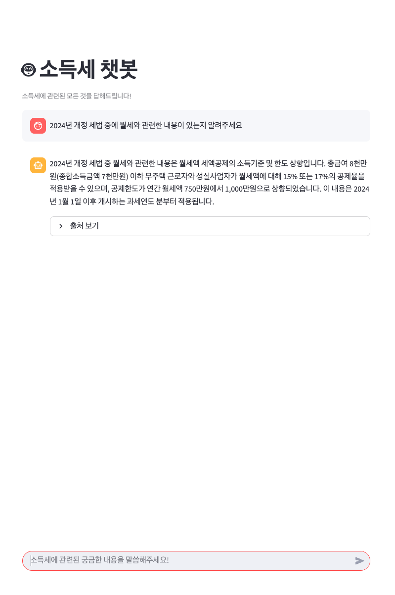

# Installation
```shell
git clone https://github.com/dev-carki/tax_law-ChatBot.git
cd tax_law-ChatBot
pip install -r requirements.txt
```

# Usage
### ‼️ 국세청 2024 연말정산 신고안내.pdf 데이터 셋 필요
```shell
streamlit run chat.py
```

# Dataset Source
[국세청] https://www.nts.go.kr/nts/cm/cntnts/cntntsView.do?mi=2304&cntntsId=238938

# Preview
<p align="center">
 
</p>